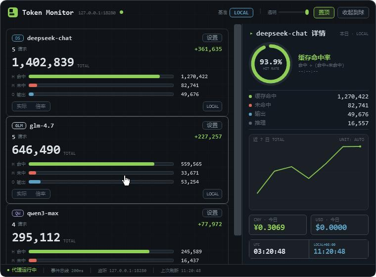
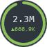
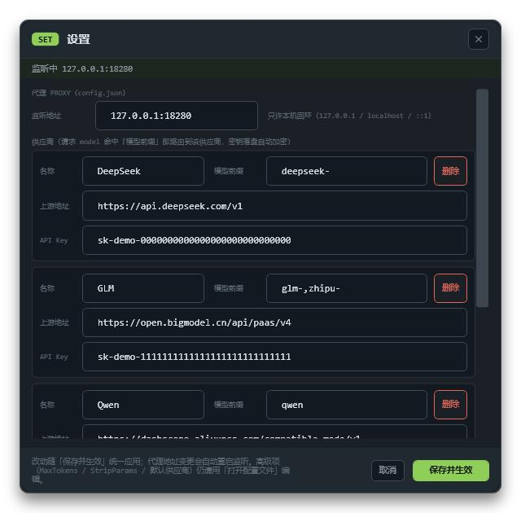
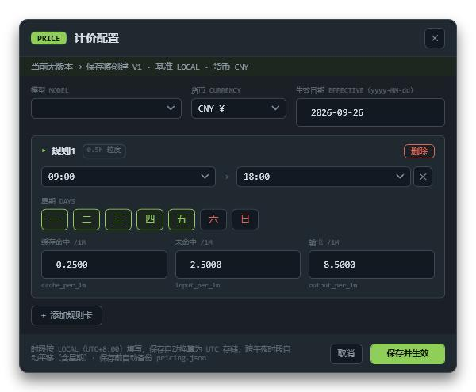

# Token Monitor

[](LICENSE)
[](https://dotnet.microsoft.com/)
[](#)
[](#构建与测试)

Windows 桌面常驻工具：代理并监控本机 LLM API 流量的 **Token 用量、缓存命中率与费用**。
**WPF (.NET 10) 单进程单 exe 架构**，移植自原 `neon-token-monitor`（Go 三进程 + WebView2）并修复其全部已审计缺陷（19 确认 + 7 风险）。

| 维度 | 原项目 | Token Monitor |
|---|---|---|
| 进程 | 3 个 exe 互相守望 | **1 个 exe** |
| 发布体积 | 3 exe + 依赖 | **~4 MB**（framework-dependent） |
| 运行时依赖 | WebView2 + .NET Desktop Runtime | 仅 .NET Desktop Runtime 10 |
| UI | Vue+WebView2 面板 / WPF 球分离 | 全 XAML：主面板 + 托盘 + 悬浮球同进程 |

## 下载

直接从 [Releases](https://github.com/sakura-le/TokenMonitor/releases/latest) 获取：

| 压缩包 | 适用 | 大小 |
|---|---|---|
| `TokenMonitor-v1.0.0-win-x64-selfcontained.zip` | **解压即用**，无需安装任何运行时 | ~83 MB |
| `TokenMonitor-v1.0.0-win-x64.zip` | 体积小，需先安装 [.NET Desktop Runtime 10](https://dotnet.microsoft.com/download/dotnet/10.0) | ~1.8 MB |

解压到任意目录，运行 `TokenMonitor.App.exe`（`data/` 生成在 exe 旁，发布升级不会覆盖数据）。

## 截图

> 以下截图均为**演示数据**（合成用量与 `sk-demo-*` 占位密钥），不含任何真实用量或密钥。

| 主面板（模型卡片 + 命中率环 + 近 7 日折线 + 成本条） | 悬浮球（收起态，轮播跑马灯） |
|---|---|
|  |  |

| 设置窗口（代理/供应商图形化配置） | 计价配置（分时段 + 分星期单价） |
|---|---|
|  |  |

## 快速开始

1. 运行 `publish/TokenMonitor.App.exe`（需 [.NET Desktop Runtime 10](https://dotnet.microsoft.com/download/dotnet/10.0)）。
2. 首次启动在 exe 旁生成 `data/`，**系统托盘**出现图标。
3. 托盘 →「**设置…**」→ 填监听地址与供应商（名称 / 上游地址 / API Key / 模型前缀）→ 保存并生效。
   API Key 落盘自动 **DPAPI 加密**（`dpapi:` 前缀）；监听地址只允许本机回环；高级项（`max_tokens`/`strip_params`/默认供应商）可「打开配置文件」直接编辑 `data/config.json`。
4. LLM 客户端把 Base URL 指向 `http://127.0.0.1:8280/v1`（OpenAI 兼容），流量即被监控。
5. 面板热键：`F2` 收起为悬浮球 / 再按或双击球展开；`F5` 刷新数据；卡片双击切换 UTC/LOCAL 口径。

> 退出：托盘图标或悬浮球右键 →「退出」。应用默认**不**开机自启（可在设置窗口打开）。

## 皮肤系统（4 套，托盘 → 皮肤 随时切换，无需重启）

| 皮肤 | 基调 | 理念 |
|---|---|---|
| 纸墨印刷 Editorial Ink | 浅 | 每日对账的印刷品：米纸墨字印章红，规线即分层 |
| 石墨终端 Graphite Terminal（默认） | 深 | 本地遥测仪表：纯平等宽、磷绿单强调、描边刻度 |
| 瑞士网格 Swiss Grid | 浅 | International Style 数据海报：粗黑大数字是唯一主角 |
| 苍穹空域 Sky HUD | 深 | 战斗机座舱 HUD：天青云白、尾焰橙、雷达扫描与瞄准框 |

全部皮肤所有角部圆润化；视觉规范见 `design/03-ui-spec.md`（与 `design/ui-samples/sample-*.html` 四套高保真样例一一对应）。

## 功能总览

- **代理引擎**：OpenAI 兼容反代（127.0.0.1:8280）、多提供商按 model 前缀路由、SSE/JSON 双路用量捕获（客户端断开仍读完上游流）、多厂商用量归一化（DeepSeek/OpenAI/DashScope 别名）、漏抓统计、请求体整备（per-provider 参数剥离、max_tokens 钳制）
- **统计计价**：UTC/本地双口径、分时段倍率（0.5h 粒度）、分时段+分星期计价（缓存命中/未命中/输出每百万单价，CNY/USD）、版本化配置+生效日期（UTC/Local 双基准，Local 基准下时段按本地时间编辑、自动换算为 UTC 存储）、跨午夜归属与日切换守望、时区切换（UTC−12…+14）、改价全量热重算（历史日一并重算）
- **存储**：SQLite（WAL、批量刷写、失败重排）、每日 LOG+CSV、XLSX 六表导出、手动补录校准+回滚、数据重置/删除、操作日志
- **三端 UI**：主面板（模型卡片 / 命中率环形图 / 近 7 日折线 / 成本条 / 双时钟，固定 760×560）、托盘全项菜单、悬浮球（轮播跑马灯 / 边缘磁吸 / 透明度 / 置顶）
- **8 个配置对话框**：设置（代理/供应商/基准/时区/悬浮球/自启）、倍率配置、计价配置、手动补录、操作日志、导出、时间范围、显示隐藏卡片——全部图形化，无需手编配置文件
- **导入**：一键迁移旧项目数据（见下）

## 旧项目数据导入

托盘 →「导入旧数据」→ 选择原 neon-token-monitor 的 `data/` 目录 → 预览（可勾选是否迁移 API 密钥，默认**不迁移**）→ 导入。
导入自动备份新库、按 manifest 幂等（重复导入会被拦截，可选 ReplaceAll 覆盖）。
已用真实旧库验证：9078 条用量 / 42 天 / 2 条漏抓 / 28 条操作日志完整迁移，倍率计价配置与设置同步导入。

## 构建与测试

```bash
dotnet build TokenMonitor.slnx -c Debug        # 构建全解决方案
dotnet  test tests/TokenMonitor.Core.Tests     # 166 项测试（含 20+7 项 Bug 回归矩阵）
dotnet publish src/TokenMonitor.App -c Release -r win-x64 --self-contained false -o publish
```

发布后运行 `publish/TokenMonitor.App.exe`；`data/` 不会被发布覆盖。

## 配置与数据文件（均在 exe 旁 `data/` 下）

| 文件 | 内容 | 推荐编辑方式 |
|---|---|---|
| `config.json` | 监听地址、供应商路由、API Key（DPAPI 加密落盘） | 设置窗口；高级项可直接编辑 |
| `settings.json` | 统计时区、生效日期基准、悬浮球透明度/置顶 | 设置窗口 |
| `pricing.json` | 计价/倍率版本链（含生效日期） | 计价配置 / 倍率配置对话框 |
| `ui_state.json` | 面板位置、卡片顺序/隐藏/口径（纯状态，无需手改） | 界面操作自动维护 |
| `token_monitor.db` | 用量日志 + 按日聚合（WAL） | 导出/补录/导入走对话框 |

## 文档地图

- `design/context/01-original-features.md` — 移植范围与原版功能清单
- `design/context/02-bug-audit.md` — 原项目 19+7 项缺陷审计（本工程已全部修复并有回归测试锁定）
- `design/context/03-architecture-decision.md` — 架构决策书
- `design/01-module-design.md` — 模块与接口契约设计
- `design/02-algorithm-design.md` — 算法与并发设计（含回归测试矩阵）
- `design/03-ui-spec.md` — UI 定稿实施规范（四皮肤令牌字典）
- `design/ui-samples/` — 四套皮肤高保真样例（浏览器直接打开）

## 已知限制

- SSE 上游读取上限 30 分钟（超时计入漏抓并提示，原版同策略）
- 稳态内存约 160 MB（原三进程方案约 250–400 MB）
- 端口 8280 被占用时应用不退出，面板/托盘显示未监听状态，可用「重载配置」自救
- 仅支持 Windows x64；监听地址仅允许本机回环（安全红线，不做局域网代理）

## License

[MIT](LICENSE)
